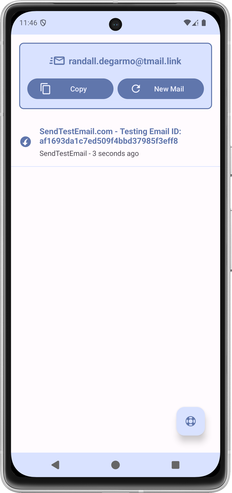
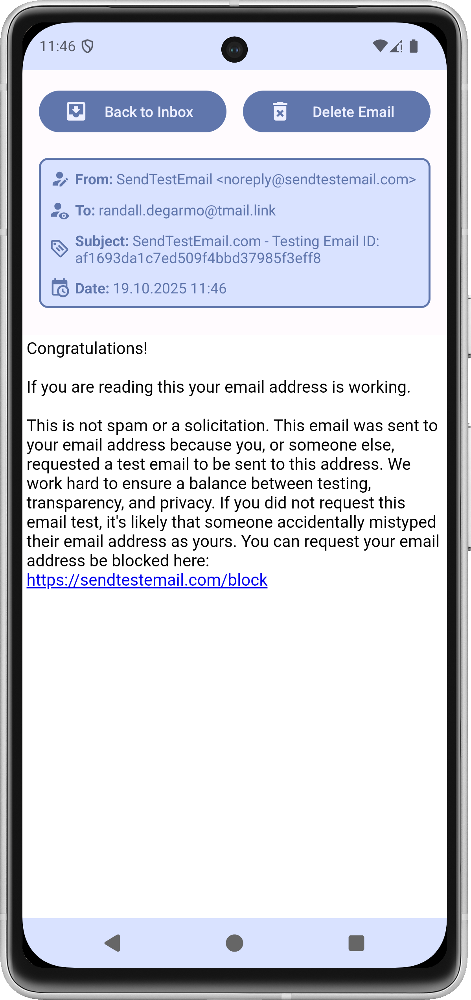
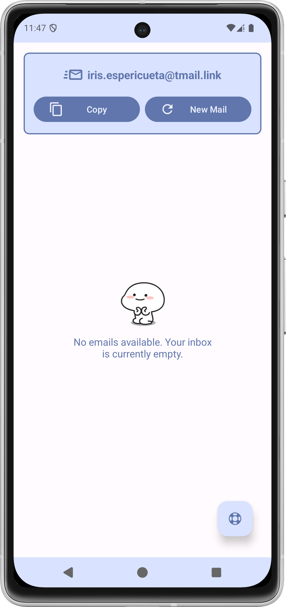

#  tmail.link

**tmail.link** is an Android app that lets you create temporary email addresses using the public service hosted at [https://tmail.link/](https://tmail.link/). The inbox of each temporary email is automatically cleared every 24 hours. 

**How it works:**  
- Generate a new temporary email address directly in the app.  
- Access the inbox to read incoming emails.  
- Delete emails from the inbox manually or wait for automatic 24-hour cleanup.  

**Requirements:**  
- Android 12 or higher (uses Monet theme support).

---

**Screenshots:**  

  
  
  

---

**You can download the latest APK from the [Releases](../../releases) page.**

If you encounter any bugs or have ideas for new features, feel free to open an issue. The developer will try to fix bugs and consider feature requests.

This project is not affiliated with or endorsed by tmail.link. The developer is not responsible for how this service is used. Use at your own risk.

**License:** The APK is for personal use only. You may download and install it, and share links to this repository, but you may not redistribute, modify, or commercialize the app. See the [LICENSE](./LICENSE) file for details.
